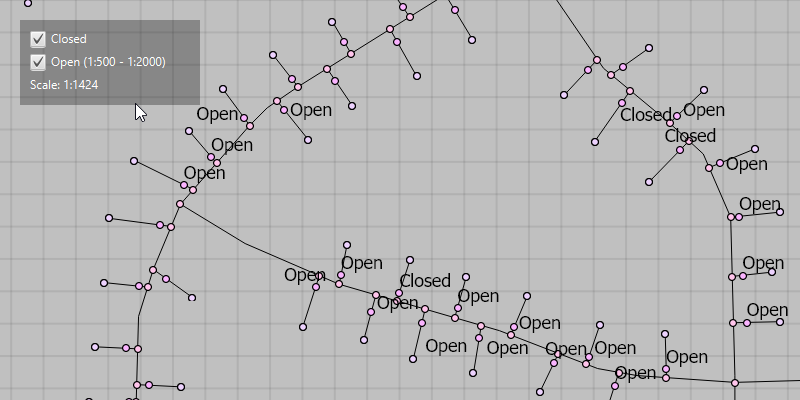

# Control annotation sublayer visibility

Change the visibility of annotation sublayers.

## Use case

An annotation layer for water utilities may contain sublayers for water mains, pipes, and valves. One might turn off the visibility of water main and pipe sublayers to make the valves easier to identify.

## How to use the sample

Zoom in to change the map's scale. The annotation sublayers were authored so that the "Open" sublayer will be visible for scales 1:500-1:2000 and the "Closed" sublayer is always visible. Use the checkboxes to toggle a sublayer's visibility.

## How it works

1. Load a `MobileMapPackage` containing annotation layers.
2. Get the `AnnotationSublayer` from the `Annotation Layer` of the mobile map package.
3. Set the annotation sublayer's visibility as required.
 
## Relevant API

* AnnotationLayer
* AnnotationSublayer
* LayerContent

## Additional Information

Annotation, which differs from labels by having a fixed place and size, is typically only relevant at particular scales. Annotation sublayers allow for finer control of annotation by allowing properties (e.g. visibility in the map and legend) to be set and others to be read (e.g. name) on subtypes of an annotation layer.

## Tags

scale, text, utilities
